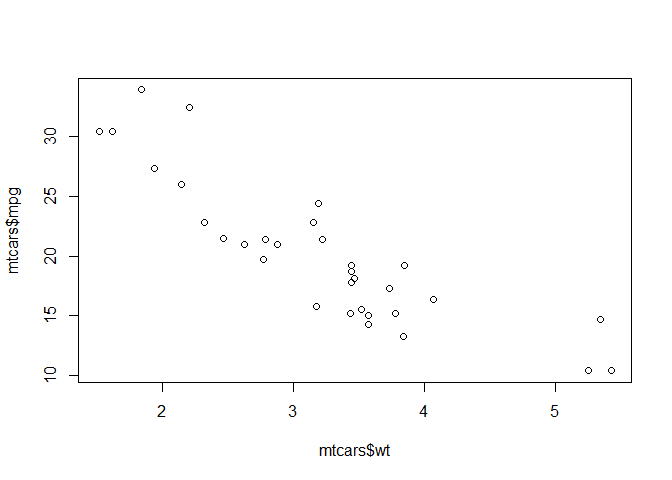

# Introduction


## R and R Studio

R is an open-source statistical programming language, good for data analysis, modelling and visualization.

Base R is the foundation of the language. Base R is extended with packages.

Packages are available from CRAN (The Comprehensive R Archive Network). Use the CRAN Task Views to determine which packages meet a statistical requirement you have.

RStudio Desktop is an integrated development environment (IDE) that makes R easier to use.

RStudio sits on top of R but does not replace R.

R, RStudio and packages are updated frequently.

## Getting to Know RStudio

The RStudio Desktop IDE has four panes:

- Source
- Console
- Environment and History
- Files and Output

Use Alt+Shift+k to view the keyboard shortcuts. Especially note Ctrl+1 to move the cursor to Source and Ctrl+2 to move the cursor to the Console.

# Using Base R

## Scalars

Interactively enter numeric expressions to create scalar values. You can also use arithmetic operators.


```r
> 1
[1] 1
> 1 + 2
[1] 3
> 5 - 2
[1] 3
> 5 * 6
[1] 30
> 24 / 6
[1] 4
```

Logical operators will output a TRUE or FALSE value.


```r
> 1 < 2
[1] TRUE
> 1 > 2
[1] FALSE
> 2 == 2
[1] TRUE
> 2 != 2
[1] FALSE
> 2 >= 3
[1] FALSE
> 2 <= 3
[1] TRUE
```

The output of an expression can be saved using the `<-` assignment operator.


```r
> a <- 5 * 4
> a
[1] 20
```

## Vectors

Vectors are an integral part of R. Use the `:` operator to create vector sequences.


```r
> 1:10
 [1]  1  2  3  4  5  6  7  8  9 10
> 10:1
 [1] 10  9  8  7  6  5  4  3  2  1
> length(1:10)
[1] 10
```

The `c()` function combines values into a vector.


```r
> c(1, 13, 7, 5)
[1]  1 13  7  5
> x <- c(1, 13, 7, 5)
> length(x)
[1] 4
> sum(x)
[1] 26
> mean(x)
[1] 6.5
```

Notice that the arithmetic operators work element-wise on vectors.


```r
> a <- 1:4
> b <- 5:8
> 
> a
[1] 1 2 3 4
> b
[1] 5 6 7 8
> 
> a + b
[1]  6  8 10 12
> a - b
[1] -4 -4 -4 -4
> a * b
[1]  5 12 21 32
> a / b
[1] 0.2000000 0.3333333 0.4285714 0.5000000
```

Logical operators also work element-wise.


```r
> a <- 1:5
> b <- 5:1
> 
> a
[1] 1 2 3 4 5
> b
[1] 5 4 3 2 1
> 
> a == b
[1] FALSE FALSE  TRUE FALSE FALSE
> a > b
[1] FALSE FALSE FALSE  TRUE  TRUE
> a < b
[1]  TRUE  TRUE FALSE FALSE FALSE
> a >= b
[1] FALSE FALSE  TRUE  TRUE  TRUE
> a <= b
[1]  TRUE  TRUE  TRUE FALSE FALSE
```

The `[1]` from the output is indicating the first element of the vector. We saw that with scalar values also. In fact, scalar values in R are simply vectors of length 1.


```r
> 1:100
  [1]   1   2   3   4   5   6   7   8   9  10  11  12  13  14  15  16  17
 [18]  18  19  20  21  22  23  24  25  26  27  28  29  30  31  32  33  34
 [35]  35  36  37  38  39  40  41  42  43  44  45  46  47  48  49  50  51
 [52]  52  53  54  55  56  57  58  59  60  61  62  63  64  65  66  67  68
 [69]  69  70  71  72  73  74  75  76  77  78  79  80  81  82  83  84  85
 [86]  86  87  88  89  90  91  92  93  94  95  96  97  98  99 100
```

If you operate on vectors of unequal lengths, the shorter vector will be recycled.


```r
> a <- 1:10
> b <- c(10, 100)
> 
> a
 [1]  1  2  3  4  5  6  7  8  9 10
> b
[1]  10 100
> 
> a + b # The result is length 10
 [1]  11 102  13 104  15 106  17 108  19 110
```

## Vector Indexing

### Positional Indexing

Use the brackets to index into a specific vector element.


```r
> x <- c(1, 13, 7, 5)
> x
[1]  1 13  7  5
> 
> x[1]
[1] 1
> x[2]
[1] 13
> x[3]
[1] 7
> x[4]
[1] 5
> x[5] # Returns NA
[1] NA
```

The special `NA` value indicates that the result is not available.

You can index with a vector of positions.


```r
> x
[1]  1 13  7  5
> 
> x[3:4]
[1] 7 5
```

### Logical Indexing

You can index with logical vectors.


```r
> x
[1]  1 13  7  5
> 
> x[c(TRUE, FALSE, TRUE, FALSE)]
[1] 1 7
```

Recall that a comparison operator will return a logical vector, such as `x > 6`. What will `x[x > 6]` return?


```r
> x[x > 6]
[1] 13  7
```

### Indexing for Sorting

Indexing is not always used to subset. It can also be used to order vector elements.

Examine the output of the `order()` function. What does this produce?


```r
> order(x)
[1] 1 4 3 2
```

Since `order()` is outputting index positions in the sorted order, how would you use this function to sort the `x` vector?


```r
> x[order(x)]
[1]  1  5  7 13
```

### Indexing for Replacement

You can assign new values to indexed elements.


```r
> x
[1]  1 13  7  5
> x[2] <- 17
> x
[1]  1 17  7  5
```

## Data Frames

Data frames are tables built from equal length vectors.


```r
> mtcars
                     mpg cyl  disp  hp drat    wt  qsec vs am gear carb
Mazda RX4           21.0   6 160.0 110 3.90 2.620 16.46  0  1    4    4
Mazda RX4 Wag       21.0   6 160.0 110 3.90 2.875 17.02  0  1    4    4
Datsun 710          22.8   4 108.0  93 3.85 2.320 18.61  1  1    4    1
Hornet 4 Drive      21.4   6 258.0 110 3.08 3.215 19.44  1  0    3    1
Hornet Sportabout   18.7   8 360.0 175 3.15 3.440 17.02  0  0    3    2
Valiant             18.1   6 225.0 105 2.76 3.460 20.22  1  0    3    1
Duster 360          14.3   8 360.0 245 3.21 3.570 15.84  0  0    3    4
Merc 240D           24.4   4 146.7  62 3.69 3.190 20.00  1  0    4    2
Merc 230            22.8   4 140.8  95 3.92 3.150 22.90  1  0    4    2
Merc 280            19.2   6 167.6 123 3.92 3.440 18.30  1  0    4    4
Merc 280C           17.8   6 167.6 123 3.92 3.440 18.90  1  0    4    4
Merc 450SE          16.4   8 275.8 180 3.07 4.070 17.40  0  0    3    3
Merc 450SL          17.3   8 275.8 180 3.07 3.730 17.60  0  0    3    3
Merc 450SLC         15.2   8 275.8 180 3.07 3.780 18.00  0  0    3    3
Cadillac Fleetwood  10.4   8 472.0 205 2.93 5.250 17.98  0  0    3    4
Lincoln Continental 10.4   8 460.0 215 3.00 5.424 17.82  0  0    3    4
Chrysler Imperial   14.7   8 440.0 230 3.23 5.345 17.42  0  0    3    4
Fiat 128            32.4   4  78.7  66 4.08 2.200 19.47  1  1    4    1
Honda Civic         30.4   4  75.7  52 4.93 1.615 18.52  1  1    4    2
Toyota Corolla      33.9   4  71.1  65 4.22 1.835 19.90  1  1    4    1
Toyota Corona       21.5   4 120.1  97 3.70 2.465 20.01  1  0    3    1
Dodge Challenger    15.5   8 318.0 150 2.76 3.520 16.87  0  0    3    2
AMC Javelin         15.2   8 304.0 150 3.15 3.435 17.30  0  0    3    2
Camaro Z28          13.3   8 350.0 245 3.73 3.840 15.41  0  0    3    4
Pontiac Firebird    19.2   8 400.0 175 3.08 3.845 17.05  0  0    3    2
Fiat X1-9           27.3   4  79.0  66 4.08 1.935 18.90  1  1    4    1
Porsche 914-2       26.0   4 120.3  91 4.43 2.140 16.70  0  1    5    2
Lotus Europa        30.4   4  95.1 113 3.77 1.513 16.90  1  1    5    2
Ford Pantera L      15.8   8 351.0 264 4.22 3.170 14.50  0  1    5    4
Ferrari Dino        19.7   6 145.0 175 3.62 2.770 15.50  0  1    5    6
Maserati Bora       15.0   8 301.0 335 3.54 3.570 14.60  0  1    5    8
Volvo 142E          21.4   4 121.0 109 4.11 2.780 18.60  1  1    4    2
```

Indexing data frames follows the same principles as vector indexing, except now we're dealing with two dimensions. Indexing is based on `data[rows, columns]`


```r
> mtcars[1, 3] # Value from row 1 column 3
[1] 160
> mtcars[1,  ] # Leave columns blank to return a row with all columns
          mpg cyl disp  hp drat   wt  qsec vs am gear carb
Mazda RX4  21   6  160 110  3.9 2.62 16.46  0  1    4    4
> mtcars[ , 1] # Leave the rows blank to return only a single column  
 [1] 21.0 21.0 22.8 21.4 18.7 18.1 14.3 24.4 22.8 19.2 17.8 16.4 17.3 15.2
[15] 10.4 10.4 14.7 32.4 30.4 33.9 21.5 15.5 15.2 13.3 19.2 27.3 26.0 30.4
[29] 15.8 19.7 15.0 21.4
```

Since column indexing is common, there are shortcuts.


```r
> mtcars$cyl       # Use the $ operator to obtain a single column as a vector
 [1] 6 6 4 6 8 6 8 4 4 6 6 8 8 8 8 8 8 4 4 4 4 8 8 8 8 4 4 4 8 6 8 4
> mtcars[ , 'cyl'] # or refer to the column by name, rather than position
 [1] 6 6 4 6 8 6 8 4 4 6 6 8 8 8 8 8 8 4 4 4 4 8 8 8 8 4 4 4 8 6 8 4
```

Use `str()` to view the structure of a data frame.


```r
> str(mtcars)
'data.frame':	32 obs. of  11 variables:
 $ mpg : num  21 21 22.8 21.4 18.7 18.1 14.3 24.4 22.8 19.2 ...
 $ cyl : num  6 6 4 6 8 6 8 4 4 6 ...
 $ disp: num  160 160 108 258 360 ...
 $ hp  : num  110 110 93 110 175 105 245 62 95 123 ...
 $ drat: num  3.9 3.9 3.85 3.08 3.15 2.76 3.21 3.69 3.92 3.92 ...
 $ wt  : num  2.62 2.88 2.32 3.21 3.44 ...
 $ qsec: num  16.5 17 18.6 19.4 17 ...
 $ vs  : num  0 0 1 1 0 1 0 1 1 1 ...
 $ am  : num  1 1 1 0 0 0 0 0 0 0 ...
 $ gear: num  4 4 4 3 3 3 3 4 4 4 ...
 $ carb: num  4 4 1 1 2 1 4 2 2 4 ...
```

Use `names()` to obtain and change column names.


```r
> names(mtcars)
 [1] "mpg"  "cyl"  "disp" "hp"   "drat" "wt"   "qsec" "vs"   "am"   "gear"
[11] "carb"
> names(mtcars)[9]
[1] "am"
> names(mtcars)[9] <- "transmission"
> names(mtcars)
 [1] "mpg"          "cyl"          "disp"         "hp"          
 [5] "drat"         "wt"           "qsec"         "vs"          
 [9] "transmission" "gear"         "carb"        
```

### Example: Using a logical vector and vectorized function to recode variables

The transmission (am) column holds a `0` if the car has an automatic transmission and a `1` for a manual transmission. Our job is to recode the ones and zeros to text.


```r
> # Step 1: create a logical vector of the items you wish to change
> mtcars$transmission == 1 
 [1]  TRUE  TRUE  TRUE FALSE FALSE FALSE FALSE FALSE FALSE FALSE FALSE
[12] FALSE FALSE FALSE FALSE FALSE FALSE  TRUE  TRUE  TRUE FALSE FALSE
[23] FALSE FALSE FALSE  TRUE  TRUE  TRUE  TRUE  TRUE  TRUE  TRUE
> # Step 2: Use the vectorized ifelse() function to create the desired vector
> ifelse(mtcars$transmission == 1, "manual", "automatic")
 [1] "manual"    "manual"    "manual"    "automatic" "automatic"
 [6] "automatic" "automatic" "automatic" "automatic" "automatic"
[11] "automatic" "automatic" "automatic" "automatic" "automatic"
[16] "automatic" "automatic" "manual"    "manual"    "manual"   
[21] "automatic" "automatic" "automatic" "automatic" "automatic"
[26] "manual"    "manual"    "manual"    "manual"    "manual"   
[31] "manual"    "manual"   
> # Step 3: Assign the new vector to the data frame
> mtcars$transmission <- ifelse(mtcars$transmission == 1, "manual", "automatic")
> 
> mtcars
                     mpg cyl  disp  hp drat    wt  qsec vs transmission
Mazda RX4           21.0   6 160.0 110 3.90 2.620 16.46  0       manual
Mazda RX4 Wag       21.0   6 160.0 110 3.90 2.875 17.02  0       manual
Datsun 710          22.8   4 108.0  93 3.85 2.320 18.61  1       manual
Hornet 4 Drive      21.4   6 258.0 110 3.08 3.215 19.44  1    automatic
Hornet Sportabout   18.7   8 360.0 175 3.15 3.440 17.02  0    automatic
Valiant             18.1   6 225.0 105 2.76 3.460 20.22  1    automatic
Duster 360          14.3   8 360.0 245 3.21 3.570 15.84  0    automatic
Merc 240D           24.4   4 146.7  62 3.69 3.190 20.00  1    automatic
Merc 230            22.8   4 140.8  95 3.92 3.150 22.90  1    automatic
Merc 280            19.2   6 167.6 123 3.92 3.440 18.30  1    automatic
Merc 280C           17.8   6 167.6 123 3.92 3.440 18.90  1    automatic
Merc 450SE          16.4   8 275.8 180 3.07 4.070 17.40  0    automatic
Merc 450SL          17.3   8 275.8 180 3.07 3.730 17.60  0    automatic
Merc 450SLC         15.2   8 275.8 180 3.07 3.780 18.00  0    automatic
Cadillac Fleetwood  10.4   8 472.0 205 2.93 5.250 17.98  0    automatic
Lincoln Continental 10.4   8 460.0 215 3.00 5.424 17.82  0    automatic
Chrysler Imperial   14.7   8 440.0 230 3.23 5.345 17.42  0    automatic
Fiat 128            32.4   4  78.7  66 4.08 2.200 19.47  1       manual
Honda Civic         30.4   4  75.7  52 4.93 1.615 18.52  1       manual
Toyota Corolla      33.9   4  71.1  65 4.22 1.835 19.90  1       manual
Toyota Corona       21.5   4 120.1  97 3.70 2.465 20.01  1    automatic
Dodge Challenger    15.5   8 318.0 150 2.76 3.520 16.87  0    automatic
AMC Javelin         15.2   8 304.0 150 3.15 3.435 17.30  0    automatic
Camaro Z28          13.3   8 350.0 245 3.73 3.840 15.41  0    automatic
Pontiac Firebird    19.2   8 400.0 175 3.08 3.845 17.05  0    automatic
Fiat X1-9           27.3   4  79.0  66 4.08 1.935 18.90  1       manual
Porsche 914-2       26.0   4 120.3  91 4.43 2.140 16.70  0       manual
Lotus Europa        30.4   4  95.1 113 3.77 1.513 16.90  1       manual
Ford Pantera L      15.8   8 351.0 264 4.22 3.170 14.50  0       manual
Ferrari Dino        19.7   6 145.0 175 3.62 2.770 15.50  0       manual
Maserati Bora       15.0   8 301.0 335 3.54 3.570 14.60  0       manual
Volvo 142E          21.4   4 121.0 109 4.11 2.780 18.60  1       manual
                    gear carb
Mazda RX4              4    4
Mazda RX4 Wag          4    4
Datsun 710             4    1
Hornet 4 Drive         3    1
Hornet Sportabout      3    2
Valiant                3    1
Duster 360             3    4
Merc 240D              4    2
Merc 230               4    2
Merc 280               4    4
Merc 280C              4    4
Merc 450SE             3    3
Merc 450SL             3    3
Merc 450SLC            3    3
Cadillac Fleetwood     3    4
Lincoln Continental    3    4
Chrysler Imperial      3    4
Fiat 128               4    1
Honda Civic            4    2
Toyota Corolla         4    1
Toyota Corona          3    1
Dodge Challenger       3    2
AMC Javelin            3    2
Camaro Z28             3    4
Pontiac Firebird       3    2
Fiat X1-9              4    1
Porsche 914-2          5    2
Lotus Europa           5    2
Ford Pantera L         5    4
Ferrari Dino           5    6
Maserati Bora          5    8
Volvo 142E             4    2
```

> Exercise: Write code to find the mean mpg for the eight cylinder cars only.


```r
> mean(mtcars[mtcars$cyl == 8, 'mpg'])
[1] 15.1
```

> Exercise: Order the `mtcars` dataframe by mpg.


```r
> mtcars[order(mtcars$mpg), ]
                     mpg cyl  disp  hp drat    wt  qsec vs transmission
Cadillac Fleetwood  10.4   8 472.0 205 2.93 5.250 17.98  0    automatic
Lincoln Continental 10.4   8 460.0 215 3.00 5.424 17.82  0    automatic
Camaro Z28          13.3   8 350.0 245 3.73 3.840 15.41  0    automatic
Duster 360          14.3   8 360.0 245 3.21 3.570 15.84  0    automatic
Chrysler Imperial   14.7   8 440.0 230 3.23 5.345 17.42  0    automatic
Maserati Bora       15.0   8 301.0 335 3.54 3.570 14.60  0       manual
Merc 450SLC         15.2   8 275.8 180 3.07 3.780 18.00  0    automatic
AMC Javelin         15.2   8 304.0 150 3.15 3.435 17.30  0    automatic
Dodge Challenger    15.5   8 318.0 150 2.76 3.520 16.87  0    automatic
Ford Pantera L      15.8   8 351.0 264 4.22 3.170 14.50  0       manual
Merc 450SE          16.4   8 275.8 180 3.07 4.070 17.40  0    automatic
Merc 450SL          17.3   8 275.8 180 3.07 3.730 17.60  0    automatic
Merc 280C           17.8   6 167.6 123 3.92 3.440 18.90  1    automatic
Valiant             18.1   6 225.0 105 2.76 3.460 20.22  1    automatic
Hornet Sportabout   18.7   8 360.0 175 3.15 3.440 17.02  0    automatic
Merc 280            19.2   6 167.6 123 3.92 3.440 18.30  1    automatic
Pontiac Firebird    19.2   8 400.0 175 3.08 3.845 17.05  0    automatic
Ferrari Dino        19.7   6 145.0 175 3.62 2.770 15.50  0       manual
Mazda RX4           21.0   6 160.0 110 3.90 2.620 16.46  0       manual
Mazda RX4 Wag       21.0   6 160.0 110 3.90 2.875 17.02  0       manual
Hornet 4 Drive      21.4   6 258.0 110 3.08 3.215 19.44  1    automatic
Volvo 142E          21.4   4 121.0 109 4.11 2.780 18.60  1       manual
Toyota Corona       21.5   4 120.1  97 3.70 2.465 20.01  1    automatic
Datsun 710          22.8   4 108.0  93 3.85 2.320 18.61  1       manual
Merc 230            22.8   4 140.8  95 3.92 3.150 22.90  1    automatic
Merc 240D           24.4   4 146.7  62 3.69 3.190 20.00  1    automatic
Porsche 914-2       26.0   4 120.3  91 4.43 2.140 16.70  0       manual
Fiat X1-9           27.3   4  79.0  66 4.08 1.935 18.90  1       manual
Honda Civic         30.4   4  75.7  52 4.93 1.615 18.52  1       manual
Lotus Europa        30.4   4  95.1 113 3.77 1.513 16.90  1       manual
Fiat 128            32.4   4  78.7  66 4.08 2.200 19.47  1       manual
Toyota Corolla      33.9   4  71.1  65 4.22 1.835 19.90  1       manual
                    gear carb
Cadillac Fleetwood     3    4
Lincoln Continental    3    4
Camaro Z28             3    4
Duster 360             3    4
Chrysler Imperial      3    4
Maserati Bora          5    8
Merc 450SLC            3    3
AMC Javelin            3    2
Dodge Challenger       3    2
Ford Pantera L         5    4
Merc 450SE             3    3
Merc 450SL             3    3
Merc 280C              4    4
Valiant                3    1
Hornet Sportabout      3    2
Merc 280               4    4
Pontiac Firebird       3    2
Ferrari Dino           5    6
Mazda RX4              4    4
Mazda RX4 Wag          4    4
Hornet 4 Drive         3    1
Volvo 142E             4    2
Toyota Corona          3    1
Datsun 710             4    1
Merc 230               4    2
Merc 240D              4    2
Porsche 914-2          5    2
Fiat X1-9              4    1
Honda Civic            4    2
Lotus Europa           5    2
Fiat 128               4    1
Toyota Corolla         4    1
```

## Tables

R can easily tabulate data. For example: How many cars have 4, 6 or 8 cylinders?


```r
> table(mtcars$cyl)

 4  6  8 
11  7 14 
```

Two (or more) dimensional tables are also possible.


```r
> table(mtcars$transmission, mtcars$cyl)
           
             4  6  8
  automatic  3  4 12
  manual     8  3  2
```

Use `addmargins()` to add the category sums or `prop.table()` to create proportion tables.


```r
> tbl <- table(mtcars$transmission, mtcars$cyl)
> addmargins(tbl)
           
             4  6  8 Sum
  automatic  3  4 12  19
  manual     8  3  2  13
  Sum       11  7 14  32
> prop.table(tbl)
           
                  4       6       8
  automatic 0.09375 0.12500 0.37500
  manual    0.25000 0.09375 0.06250
```

## Base Graphics

Base Graphics are the plotting functions included with Base R. Other packages such as `ggplot2` extend R's plotting capabilities.


```r
> plot(mtcars$wt, mtcars$mpg) # As weight increases, mpg decreases
```

 

```r
> hist(mtcars$mpg)
```

 

```r
> boxplot(mpg ~ cyl, data = mtcars)
```

 

## Coding Style

Code is read more often than it is written so proper style, commenting, and formatting is important, especially if you are sharing code with others.

Review Hadley Wickham's R Style Guide for details at http://adv-r.had.co.nz/Style.html.
