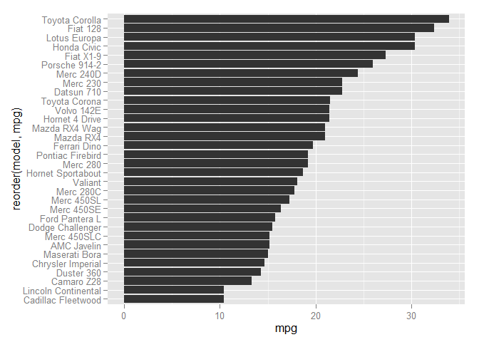

# Plotting with ggplot2


Prerequisite: please copy the model names into the mtcars dataframe:


```r
> mtcars$model <- rownames(mtcars)
```

## Background

Much of this is from http://opr.princeton.edu/workshops/201501/ggplot2Jan2014DawnKoffman.pdf

`ggplot2` can create most of the statistical graphics from base R, but using a consistent syntax and grammar.

> "attempt to take the good things about base and lattice graphics and improve on them with a strong, underlying model"

Two ways to produce plot objects:

1. ~~`qplot`~~ Do not use! It will only confuse you.
2. `ggplot` is the full implementation of the Grammar of Graphics

The Grammar Defines Components of Graphics

- _data_: in ggplot2, data must be stored as an R data frame
- _geoms_: describe the type of geometric objects that represent data. For example, points, lines, bars, etc.
- _aesthetics_: describe visual characteristics that represent data. For example, position, size, color, shape, transparency, fill
- _facets_: describe how data is split into subsets and displayed as multiple small graphs.
- _stats_: describe statistical transformations that typically summarize data. For example, counts, regression lines, smoothing, etc.
- _coordinate system_: describes the two-dimensional space that data is projected onto. For example, cartesian coordinates, polar coordinates, map projections, etc.
- _scales_: for each aesthetic, describe how visual characteristics are converted to display values. For example, log scales, numeric scales, discrete scales, color scales, etc.

## Building Up a Plot

### A Basic X/Y Plot

We will use the `diamonds` dataset from the ggplot2 package.


```r
> ## library(ggplot2)
> 
> dim(diamonds)
[1] 53940    10
> head(diamonds)
  carat       cut color clarity depth table price    x    y    z
1  0.23     Ideal     E     SI2  61.5    55   326 3.95 3.98 2.43
2  0.21   Premium     E     SI1  59.8    61   326 3.89 3.84 2.31
3  0.23      Good     E     VS1  56.9    65   327 4.05 4.07 2.31
4  0.29   Premium     I     VS2  62.4    58   334 4.20 4.23 2.63
5  0.31      Good     J     SI2  63.3    58   335 4.34 4.35 2.75
6  0.24 Very Good     J    VVS2  62.8    57   336 3.94 3.96 2.48
```

Let's examine the relationship of carat weight to diamond price


```r
> ggplot(diamonds, aes(x = carat, y = price)) +
+   geom_point()
```

 

This code shows the following points:

1. The `ggplot` function creates a plot object.
2. Aesthetics map the data from diamonds to the plot
3. Add the `geom_point()` to create the geometric object

Why do we use `+` instead of `%>%`? 

As expected, price increases as carat weight increases. What other patterns do you see in this plot?

> Exercise: Create a plot of the `mtcars` dataset, showing weight (wt) on the x-axis and miles per gallon (mpg) on the y-axis. What is the relationship of the two variables?


```r
> ggplot(mtcars, aes(x = wt, y = mpg)) +
+   geom_point()
```

 

### Additional Aesthetics

Use the help to understand what additional aesthetics are possible.


```r
> ?geom_point
```

Let's try coloring the points based on the clarity grade. How would you do this?


```r
> ggplot(diamonds, aes(x = carat, y = price, color = clarity)) +
+   geom_point()
```

 

### Understanding Aesthetics vs. Graphical Options

Rember, `aes()` should wrap options _only_ if they change with the data.

Assume you wanted each dot to be blue. In that case, do not use aes for the color.


```r
> ggplot(diamonds, aes(x = carat, y = price)) +
+   geom_point(color = "blue")
```

 

> Exercise: Plot the mtcars dataset with `x = wt, y = mpg`, but make the points vary in size according to the horsepower of the car. What is the relationship?


```r
> ggplot(mtcars, aes(x = wt, y = mpg, size = hp)) +
+   geom_point()
```

 

### Adding Facets

What if we wanted to examine the relationship of diamond price, with each clarity grade split out into a separate graph?


```r
> ggplot(diamonds, aes(x = carat, y = price)) +
+   geom_point() +
+   facet_wrap(~ clarity) 
```

 

Here are some interesting trends. I1 shows a smooth relationship, but as clarity grade increases, there seems to be a larger jump in price at around one carat. How would we examine only the IF stones?


```r
> diamonds_if_only <- diamonds %>%
+   filter(clarity == 'IF')
> 
> ggplot(diamonds_if_only, aes(x = carat, y = price)) +
+   geom_point() +
+   facet_wrap(~ color) 
```

 

### Stats

> Exercise: create a bar chart of `mtcars` with x = cyl and the height of the bars is the number of cars in that group. Hint: geom_bar() will count up the cars for you.


```r
> ggplot(mtcars, aes(x = cyl)) +
+   geom_bar()
stat_bin: binwidth defaulted to range/30. Use 'binwidth = x' to adjust this.
```

 

Notice that no y aesthetic is required. `stat_bin` will calculate the bar height automatically.

If you wish to create barplots of data without any transformation, you must specify `stat=identity()`


```r
> ggplot(mtcars, aes(x = model, y = mpg)) +
+   geom_bar(stat = "identity")
```

 

### Coordinates

This is not very easy to read. The model names will be easier to read if we flip the coordinate system.


```r
> ggplot(mtcars, aes(x = model, y = mpg)) +
+   geom_bar(stat = "identity") +
+   coord_flip()
```

 

This plot can also be improved by reordering the models by mpg.


```r
> ggplot(mtcars, aes(x = reorder(model, mpg), y = mpg)) +
+   geom_bar(stat = "identity") +
+   coord_flip()
```

 

### Scales

The final Grammar of Graphics element customizes the scales of the plot.

Imagine we wanted the y-axis to extend to 50, with labels at every five mpg.


```r
> ggplot(mtcars, aes(x = reorder(model, mpg), y = mpg)) +
+   geom_bar(stat = "identity") +
+   scale_y_continuous(limits = c(0, 50), breaks = seq(0, 50, by = 5)) +
+   coord_flip()
```

 

Also note the shortcut functions `xlim` and `ylim`.

## A Few Other Geoms

### Smoothing

Nothing says you have to have only one geom!


```r
> ggplot(mtcars, aes(x = wt, y = mpg)) +
+   geom_point() +
+   geom_smooth()
geom_smooth: method="auto" and size of largest group is <1000, so using loess. Use 'method = x' to change the smoothing method.
```

 

#### Boxplot


```r
> ggplot(mtcars, aes(x = factor(cyl), y = mpg)) +
+   geom_boxplot() 
```

 

#### Density and Histograms


```r
> ggplot(diamonds, aes(x = price)) +
+   geom_histogram()
stat_bin: binwidth defaulted to range/30. Use 'binwidth = x' to adjust this.
```

 


```r
> ggplot(iris, aes(x = Petal.Length, fill = Species)) +
+   geom_density(alpha = 0.50) 
```

 

#### Line


```r
> ggplot(economics, aes(x = date, y = unemploy)) +
+   geom_line()
```

 

## Customizing the Look and Feel
